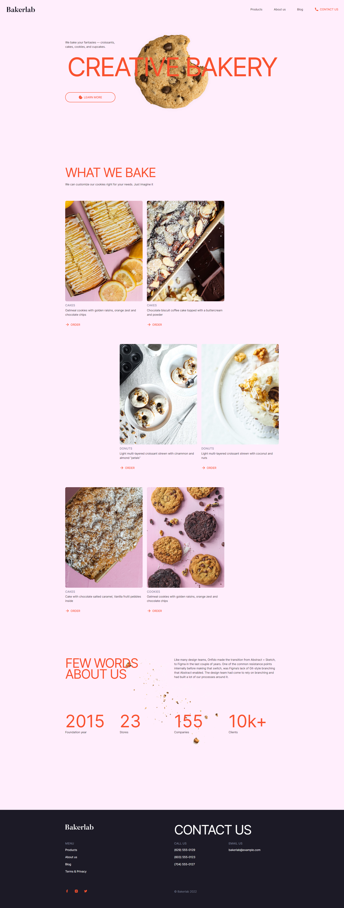

# Bakerlab - Creative bakery

> Responsive Landing page for creative bakery
> Live demo [_here_](https://mariuszgit.github.io/creativeBakery/). :cookie:

## General Information
This project is a landing page based on a project provided by Mate Academy. The aim of the project is to allow Mate Academy students to practice web development, based on a Figma project.

## Technologies Used
- HTML5 (BEM)
- Flexbox
- Grid
- CSS3 (SASS)
- Javascript
- Figma

## Screenshot

